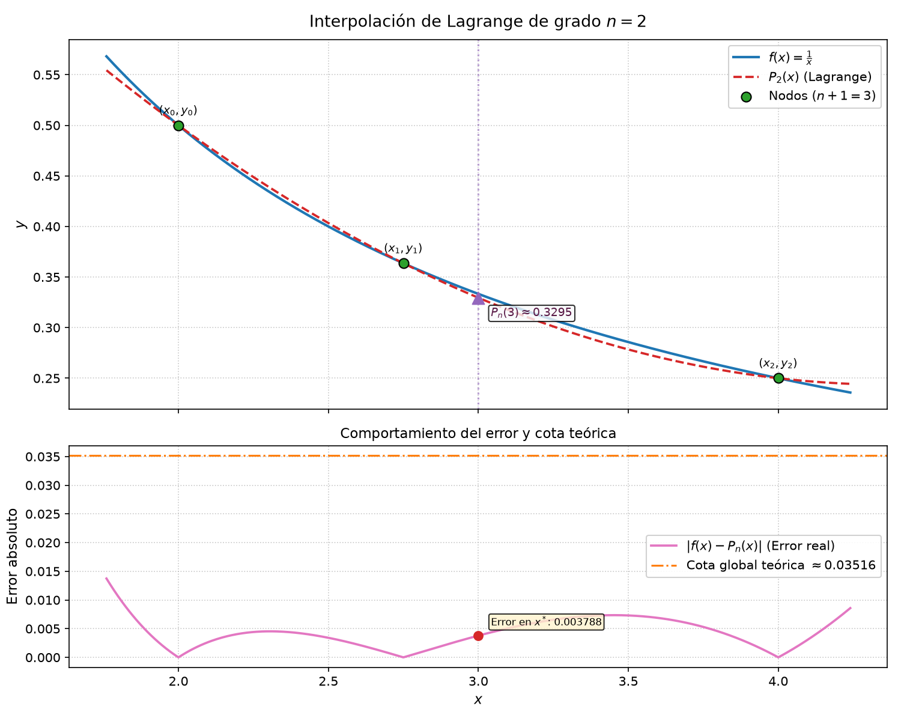

# Polinomio de Interpolación de Lagrange — Métodos Numéricos

Trabajo práctico (Taller 2) de la asignatura Métodos Numéricos, programa de Ingeniería de Software, Institución Universitaria Pascual Bravo (Medellín).

Este proyecto implementa la construcción simbólica y exacta del polinomio de interpolación de Lagrange, la interpolación numérica directa y por el método de Neville, el cálculo de errores absoluto y relativo, y la determinación rigurosa de las cotas teóricas de error global y puntual utilizando el método de bisección.

La fundamentación teórica y algorítmica sigue estrictamente las secciones 3.1 (*Lagrange Polynomial and Error Theorem*) y 3.2 (*Neville's Method*) del texto guía:
> **Burden, R. L., & Faires, J. D. (2010). *Numerical Analysis* (9th ed.). Cengage Learning.**

---

## 1. Cumplimiento de Requisitos

A continuación se detalla la correspondencia entre los requerimientos solicitados y los módulos implementados:

| ID | Requisito del enunciado | Implementación en el software |
|---|---|---|
| **R1** | Ingresar $n+1$ puntos de un arreglo | Soporte para cualquier cantidad de nodos $n+1 \ge 2$. Dos modalidades de entrada: (a) función $f(x)$ y nodos (cálculo automático de $f(x_k)$); (b) tabla directa de datos $(x_k, y_k)$. |
| **R2** | Aproximar cualquier función deseada | Analizador seguro basado en `sympy.parse_expr` con lista blanca estricta (`sin`, `cos`, `tan`, `exp`, `log`, `sqrt`, `abs`, etc.). Sin uso de `eval` o `exec`. |
| **R3** | Construir el polinomio de Lagrange | Construcción simbólica paso a paso de cada polinomio base $L_{n,k}(x)$ y del polinomio completo $P_n(x)$ en forma exacta y expandida. Verificación de propiedades ($\sum L_k = 1$ y $P_n(x_k) = f(x_k)$). |
| **R4** | Interpolar sin el polinomio | Cálculo en un punto $x^*$ sin formar $P_n(x)$ por dos vías independientes: (a) evaluación directa de la fórmula de Lagrange; (b) algoritmo de Neville con tabla $Q_{i,j}$ completa (Algoritmo 3.1 de Burden & Faires). |
| **R5** | Error máximo (cota teórica) | Teorema del residuo de Lagrange (Teorema 3.3). Determinación de $M = \max |f^{(n+1)}|$ y $\max |g(x)|$ mediante extremos y raíces de las derivadas obtenidas con método de bisección propio. Cotas global y puntual. |
| **R6** | Error relativo respecto a un punto ingresado | Cálculo del error absoluto $|f(x^*) - P_n(x^*)|$ y error relativo porcentual tomando como denominador el valor verdadero $f(x^*)$. |
| **R7** | Polinomio de grado $n$, valor en punto particular y errores | Resumen final consolidado que presenta $P_n(x)$, $P_n(x^*)$, $f(x^*)$, errores y la verificación de la desigualdad $E_{\text{real}} \le \text{cota puntual} \le \text{cota global}$. |

---

## 2. Fundamentación Matemática

### 2.1 Polinomio de Lagrange
Dados $n+1$ nodos distintos $x_0, x_1, \dots, x_n$ y sus valores $f(x_0), \dots, f(x_n)$, el polinomio interpolador de Lagrange de grado a lo sumo $n$ se define como:

$$P_n(x) = \sum_{k=0}^{n} f(x_k) L_{n,k}(x)$$

donde cada polinomio base de Lagrange está dado por:

$$L_{n,k}(x) = \prod_{\substack{i=0 \\ i \neq k}}^{n} \frac{x - x_i}{x_k - x_i}$$

Propiedades algebraicas verificadas en tiempo de ejecución:
1. $L_{n,k}(x_j) = \delta_{kj}$ (vale $1$ si $j = k$ y $0$ si $j \neq k$).
2. $\sum_{k=0}^{n} L_{n,k}(x) = 1$ para todo $x$.

### 2.2 Interpolación sin Polinomio (Algoritmo de Neville)
El método de Neville genera iterativamente aproximaciones polinómicas de grados sucesivos evaluadas directamente en $x^*$:

$$Q_{i,0} = f(x_i), \quad 0 \le i \le n$$

$$Q_{i,j} = \frac{(x^* - x_{i-j}) Q_{i,j-1} - (x^* - x_i) Q_{i-1,j-1}}{x_i - x_{i-j}}, \quad 1 \le j \le i \le n$$

El valor final interpolado corresponde a $P_n(x^*) = Q_{n,n}$.

### 2.3 Teorema del Residuo y Cotas de Error
De acuerdo con el Teorema 3.3 de Burden & Faires, si $f \in C^{n+1}[a, b]$ y $x_0, \dots, x_n \in [a, b]$, para cada $x \in [a, b]$ existe $\xi(x) \in (a, b)$ tal que:

$$f(x) - P_n(x) = \frac{f^{(n+1)}(\xi)}{(n+1)!} \prod_{i=0}^{n} (x - x_i)$$

Definiendo el polinomio nodal $g(x) = \prod_{i=0}^{n} (x - x_i)$ y la cota superior $M = \max_{\xi \in [a, b]} |f^{(n+1)}(\xi)|$, se calculan las siguientes cotas:
- **Cota global en $[a, b]$:**
  $$|f(x) - P_n(x)| \le \frac{M}{(n+1)!} \max_{x \in [a, b]} |g(x)|$$
- **Cota puntual en $x^*$:**
  $$|f(x^*) - P_n(x^*)| \le \frac{M}{(n+1)!} |g(x^*)|$$

El intervalo $[a, b]$ se define como el menor intervalo cerrado que contiene todos los nodos $x_0, \dots, x_n$ y el punto de evaluación $x^*$. Si $x^*$ se encuentra fuera de los nodos, se emite una advertencia de extrapolación.

### 2.4 Búsqueda de Extremos con Bisección Propia
Para determinar $\max_{x \in [a, b]} |g(x)|$ y $M$:
1. Los candidatos a extremos de $|g(x)|$ son los extremos del intervalo $a, b$ y las raíces reales de $g'(x) = 0$ en $(a, b)$.
2. Las raíces de $g'(x)$ y $f^{(n+2)}(x)$ se localizan mediante un escaneo de subintervalos buscando cambios de signo, seguido del algoritmo de bisección propio (Burden & Faires, Algoritmo 2.1) con una tolerancia por defecto de $10^{-12}$.
3. Como salvaguarda para $M$, se realiza un muestreo denso sobre $[a, b]$ evaluando $|f^{(n+1)}(x)|$.

---

## 3. Instalación y Requisitos

El proyecto requiere Python 3.10 o superior.

### 3.1 Configuración del entorno virtual
```bash
# Clonar el repositorio
git clone https://github.com/romerobrayan/Taller2-Meto2Numericos.git
cd Taller2-Meto2Numericos

# Crear y activar el entorno virtual
python3 -m venv .venv
source .venv/bin/activate   # En Linux / macOS
# .venv\Scripts\activate    # En Windows

# Instalar dependencias
pip install -r requirements.txt
```

---

## 4. Instrucciones de Uso

El programa cuenta con dos interfaces: un menú interactivo en consola y una interfaz de línea de comandos (CLI) no interactiva.

### 4.1 Menú interactivo
Para iniciar el menú en español:
```bash
python main.py
```
Opciones del menú principal:
- `1`: Ingresar una función $f(x)$ y el arreglo de nodos.
- `2`: Ingresar una tabla de datos $(x_k, y_k)$ sin función analítica.
- `3`: Cambiar los puntos $x^*$ a evaluar.
- `4`: Mostrar el reporte paso a paso completo (secciones 1 a 9).
- `5`: Mostrar únicamente el resumen final consolidado.
- `6`: Generar y guardar la gráfica comparativa en PNG.
- `7`: Exportar el reporte en formato Markdown.
- `8`: Configurar precisión decimal, tolerancia y número de iteraciones de bisección.
- `9`: Cargar automáticamente el ejemplo de clase (Test B: $f(x) = 1/x$, nodos $2, 2.75, 4$, $x^* = 3$).
- `10`: Ver ayuda sobre sintaxis matemática admitida.
- `0`: Salir.

### 4.2 Ejecución directa por CLI
Para reproducir ejecuciones completas en una sola instrucción:

```bash
# Modo función: Test B del texto guía
python main.py --f "1/x" --nodos "2, 2.75, 4" --x 3

# Generando gráfica y exportando reporte a Markdown
python main.py --f "1/x" --nodos "2, 2.75, 4" --x 3 --graficar --exportar

# Modo tabla de datos
python main.py --nodos "0, 2, 5" --valores "18, 24, 21" --x 3

# Mostrando únicamente el resumen final
python main.py --f "exp(x)*cos(x)" --nodos "0, 0.5, 1" --x 0.75 --solo-resumen
```

---

## 5. Ejemplo Real de Ejecución (Test B)

Salida de consola obtenida al ejecutar `python main.py --f "1/x" --nodos "2, 2.75, 4" --x 3`:

```text
==============================================================================
         POLINOMIO DE INTERPOLACIÓN DE LAGRANGE - REPORTE PASO A PASO         
==============================================================================
Datos: f(x) = 1/x | nodos: 2, 11/4, 4 | x*: 3
Generado: 2026-10-05 16:19:51

------------------------------------------------------------------------------
1. Datos
------------------------------------------------------------------------------
Modo: función f(x) evaluada en los nodos.
f(x) = 1/x

  k | x_k         | f(x_k)
  --+-------------+------------------
  0 | 2           | 1/2 ≈ 0.5
  1 | 11/4 ≈ 2.75 | 4/11 ≈ 0.36363636
  2 | 4           | 1/4 ≈ 0.25

Número de puntos: n + 1 = 3   =>   n = 2
Grado del polinomio de Lagrange: a lo sumo n = 2

------------------------------------------------------------------------------
2. Polinomios base de Lagrange
------------------------------------------------------------------------------
L_{2,k}(x) = Π_{i≠k} (x - x_i) / (x_k - x_i)

k = 0:
  Numerador:   (x - 11/4)(x - 4) = x^2 - 27*x/4 + 11
  Denominador: (2 - 11/4)(2 - 4) = (-3/4)(-2) = 3/2 ≈ 1.5
  L_{2,0}(x) = [x^2 - 27*x/4 + 11] / (3/2)
  L_{2,0}(x) = 2*x^2/3 - 9*x/2 + 22/3

k = 1:
  Numerador:   (x - 2)(x - 4) = x^2 - 6*x + 8
  Denominador: (11/4 - 2)(11/4 - 4) = (3/4)(-5/4) = -15/16 ≈ -0.9375
  L_{2,1}(x) = [x^2 - 6*x + 8] / (-15/16)
  L_{2,1}(x) = -16*x^2/15 + 32*x/5 - 128/15

k = 2:
  Numerador:   (x - 2)(x - 11/4) = x^2 - 19*x/4 + 11/2
  Denominador: (4 - 2)(4 - 11/4) = (2)(5/4) = 5/2 ≈ 2.5
  L_{2,2}(x) = [x^2 - 19*x/4 + 11/2] / (5/2)
  L_{2,2}(x) = 2*x^2/5 - 19*x/10 + 11/5

------------------------------------------------------------------------------
3. Polinomio de Lagrange
------------------------------------------------------------------------------
P_2(x) = Σ_{k=0}^{2} f(x_k)·L_{2,k}(x) = f(x_0)·L_{2,0}(x) + f(x_1)·L_{2,1}(x) + f(x_2)·L_{2,2}(x)

Forma sin expandir:
P_2(x) =   (1/2)·[(x - 11/4)(x - 4) / (3/2)]
         + (4/11)·[(x - 2)(x - 4) / (-15/16)]
         + (1/4)·[(x - 2)(x - 11/4) / (5/2)]

Sustituyendo cada L_{2,k}(x) ya expandido:
P_2(x) =   (1/2)·(2*x^2/3 - 9*x/2 + 22/3)
         + (4/11)·(-16*x^2/15 + 32*x/5 - 128/15)
         + (1/4)·(2*x^2/5 - 19*x/10 + 11/5)

Expandido y simplificado:
P_2(x) = x^2/22 - 35*x/88 + 49/44

Con coeficientes decimales (8 cifras significativas):
P_2(x) ≈ 0.045454545*x^2 - 0.39772727*x + 1.1136364

------------------------------------------------------------------------------
4. Verificaciones
------------------------------------------------------------------------------
a) P_2(x_k) debe ser igual a f(x_k) en cada nodo:
  k | x_k         | P_2(x_k)          | f(x_k)            | Estado
  --+-------------+-------------------+-------------------+-------
  0 | 2           | 1/2 ≈ 0.5         | 1/2 ≈ 0.5         | OK
  1 | 11/4 ≈ 2.75 | 4/11 ≈ 0.36363636 | 4/11 ≈ 0.36363636 | OK
  2 | 4           | 1/4 ≈ 0.25        | 1/4 ≈ 0.25        | OK

b) Σ_k L_{2,k}(x) = 1  (debe ser 1)   ->  OK

------------------------------------------------------------------------------
5. Interpolación en x* = 3 (con el polinomio)
------------------------------------------------------------------------------
P_2(3) = (3)^2/22 - 35*(3)/88 + 49/44
P_2(3) = 29/88 ≈ 0.32954545

------------------------------------------------------------------------------
6. Interpolación sin el polinomio
------------------------------------------------------------------------------
a) Evaluación directa de la fórmula de Lagrange en x* (no se construye P_n):
   L_{2,k}(x*) = Π_{i≠k} (x* - x_i) / (x_k - x_i)
   L_{2,0}(3) = (3 - 11/4)(3 - 4) / [(2 - 11/4)(2 - 4)] = -1/6 ≈ -0.16666667
   L_{2,1}(3) = (3 - 2)(3 - 4) / [(11/4 - 2)(11/4 - 4)] = 16/15 ≈ 1.0666667
   L_{2,2}(3) = (3 - 2)(3 - 11/4) / [(4 - 2)(4 - 11/4)] = 1/10 ≈ 0.1

   k | L_k(x*)            | f(x_k)            | L_k(x*)·f(x_k)
   --+--------------------+-------------------+---------------------
   0 | -1/6 ≈ -0.16666667 | 1/2 ≈ 0.5         | -1/12 ≈ -0.083333333
   1 | 16/15 ≈ 1.0666667  | 4/11 ≈ 0.36363636 | 64/165 ≈ 0.38787879
   2 | 1/10 ≈ 0.1         | 1/4 ≈ 0.25        | 1/40 ≈ 0.025

   Σ L_k(x*)·f(x_k) = 29/88 ≈ 0.32954545
   Σ L_k(x*) = 1  (debe ser 1)  ->  OK

b) Método de Neville (Burden & Faires, Algoritmo 3.1):
   Q_{i,0} = f(x_i)
   Q_{i,j} = [(x* - x_{i-j})·Q_{i,j-1} - (x* - x_i)·Q_{i-1,j-1}] / (x_i - x_{i-j})
   Q_{1,1} = [(3 - 2)·(4/11) - (3 - 11/4)·(1/2)] / (11/4 - 2) = 7/22 ≈ 0.31818182
   Q_{2,1} = [(3 - 11/4)·(1/4) - (3 - 4)·(4/11)] / (4 - 11/4) = 15/44 ≈ 0.34090909
   Q_{2,2} = [(3 - 2)·(15/44) - (3 - 4)·(7/22)] / (4 - 2) = 29/88 ≈ 0.32954545

   i | x_i  | Q_{i,0}    | Q_{i,1}    | Q_{i,2}
   --+------+------------+------------+-----------
   0 | 2    | 0.5        |            |
   1 | 2.75 | 0.36363636 | 0.31818182 |
   2 | 4    | 0.25       | 0.34090909 | 0.32954545

   P_2(3) = Q_{2,2} = 29/88 ≈ 0.32954545

Comprobación (los tres valores deben coincidir):
   Polinomio expandido (sección 5): 29/88 ≈ 0.32954545
   Evaluación directa:              29/88 ≈ 0.32954545   ->  OK
   Método de Neville:               29/88 ≈ 0.32954545   ->  OK

------------------------------------------------------------------------------
7. Errores en x* = 3
------------------------------------------------------------------------------
f(3) = 1/3 ≈ 0.33333333   (valor verdadero)
P_2(3) = 29/88 ≈ 0.32954545

Error absoluto = |f(x*) - P_2(x*)| = |1/3 - 29/88| = 1/264 ≈ 0.0037878788
Error relativo = |f(x*) - P_2(x*)| / |f(x*)| × 100 = (1/264) / |1/3| × 100 = 25/22 % ≈ 1.1363636 %
(El denominador es el valor VERDADERO f(x*), no la aproximación.)

------------------------------------------------------------------------------
8. Cota teórica del error
------------------------------------------------------------------------------
Teorema 3.3: f(x) - P_n(x) = f^(n+1)(ξ)/(n+1)! · Π_{i=0}^{n} (x - x_i),  ξ en [a, b]
Intervalo [a, b] = [2, 4]  (contiene los nodos y x*)
Orden de la derivada: n + 1 = 3

Paso 1. M = max |f^(3)(x)| en [a, b]
   f^(3)(x) = -6/x^4
   f^(4)(x) = 24/x^5
   Candidatos: extremos a, b y raíces de f^(4) en [a, b] (bisección, tol = 1e-12, barrido en 199 subintervalos).
   f^(4) no cambia de signo en [a, b]: no hay raíces interiores.

   x | f^(3)(x)            | |f^(3)(x)|        | origen
   --+---------------------+-------------------+----------
   2 | -3/8 ≈ -0.375       | 3/8 ≈ 0.375       | extremo a
   4 | -3/128 ≈ -0.0234375 | 3/128 ≈ 0.0234375 | extremo b
   (También se revisó un muestreo denso de 2000 puntos.)
   M = 3/8 ≈ 0.375 en x = 2

Paso 2. (n+1)! = 3! = 6   =>   M/(n+1)! = 1/16 ≈ 0.0625

Paso 3. max |g(x)| en [a, b], con g(x) = Π_{i=0}^{n} (x - x_i)
   g(x) = (x - 2)(x - 11/4)(x - 4)
        = x^3 - 35*x^2/4 + 49*x/2 - 22
   g'(x) = 3*x^2 - 35*x/2 + 49/2
   Candidatos: extremos a, b y raíces de g'(x) en [a, b]. Se recorre [a, b] en 199 subintervalos buscando cambios de signo de g' y se aplica bisección (tol = 1e-12, máx. 100 iteraciones) en cada uno.

   Raíz 1 de g'(x):
   Intervalo inicial [2.3316582914573, 2.3417085427136]:
   i  | a               | b               | p               | g'(a)         | g'(p)          | signo | intervalo que se conserva
   ---+-----------------+-----------------+-----------------+---------------+----------------+-------+--------------------------
   1  | 2.3316582914573 | 2.3417085427136 | 2.3366834170854 | 0.0058710639  | -0.011691624   | -     | izquierdo [a, p]
   2  | 2.3316582914573 | 2.3366834170854 | 2.3341708542714 | 0.0058710639  | -0.002929219   | -     | izquierdo [a, p]
   3  | 2.3316582914573 | 2.3341708542714 | 2.3329145728643 | 0.0058710639  | 0.0014661877   | +     | derecho [p, b]
   4  | 2.3329145728643 | 2.3341708542714 | 2.3335427135678 | 0.0014661877  | -0.0007326993  | -     | izquierdo [a, p]
   5  | 2.3329145728643 | 2.3335427135678 | 2.3332286432161 | 0.0014661877  | 0.00036644829  | +     | derecho [p, b]
   6  | 2.3332286432161 | 2.3335427135678 | 2.333385678392  | 0.00036644829 | -0.00018319949 | -     | izquierdo [a, p]
   7  | 2.3332286432161 | 2.333385678392  | 2.333307160804  | 0.00036644829 | 9.1605908e-05  | +     | derecho [p, b]
   8  | 2.333307160804  | 2.333385678392  | 2.333346419598  | 9.1605908e-05 | -4.5801413e-05 | -     | izquierdo [a, p]
   9  | 2.333307160804  | 2.333346419598  | 2.333326790201  | 9.1605908e-05 | 2.2901092e-05  | +     | derecho [p, b]
   10 | 2.333326790201  | 2.333346419598  | 2.3333366048995 | 2.2901092e-05 | -1.1450449e-05 | -     | izquierdo [a, p]
   11 | 2.333326790201  | 2.3333366048995 | 2.3333316975503 | 2.2901092e-05 | 5.7252488e-06  | +     | derecho [p, b]
   12 | 2.3333316975503 | 2.3333366048995 | 2.3333341512249 | 5.7252488e-06 | -2.8626184e-06 | -     | izquierdo [a, p]
   13 | 2.3333316975503 | 2.3333341512249 | 2.3333329243876 | 5.7252488e-06 | 1.4313107e-06  | +     | derecho [p, b]
   14 | 2.3333329243876 | 2.3333341512249 | 2.3333335378062 | 1.4313107e-06 | -7.1565497e-07 | -     | izquierdo [a, p]
   15 | 2.3333329243876 | 2.3333335378062 | 2.3333332310969 | 1.4313107e-06 | 3.5782758e-07  | +     | derecho [p, b]
   16 | 2.3333332310969 | 2.3333335378062 | 2.3333333844516 | 3.5782758e-07 | -1.7891377e-07 | -     | izquierdo [a, p]
   17 | 2.3333332310969 | 2.3333333844516 | 2.3333333077742 | 3.5782758e-07 | 8.945689e-08   | +     | derecho [p, b]
   18 | 2.3333333077742 | 2.3333333844516 | 2.3333333461129 | 8.945689e-08  | -4.4728445e-08 | -     | izquierdo [a, p]
   19 | 2.3333333077742 | 2.3333333461129 | 2.3333333269436 | 8.945689e-08  | 2.2364226e-08  | +     | derecho [p, b]
   20 | 2.3333333269436 | 2.3333333461129 | 2.3333333365282 | 2.2364226e-08 | -1.1182109e-08 | -     | izquierdo [a, p]
   21 | 2.3333333269436 | 2.3333333365282 | 2.3333333317359 | 2.2364226e-08 | 5.5910618e-09  | +     | derecho [p, b]
   22 | 2.3333333317359 | 2.3333333365282 | 2.3333333341321 | 5.5910618e-09 | -2.7955238e-09 | -     | izquierdo [a, p]
   23 | 2.3333333317359 | 2.3333333341321 | 2.333333332934  | 5.5910618e-09 | 1.397769e-09   | +     | derecho [p, b]
   24 | 2.333333332934  | 2.3333333341321 | 2.333333333533  | 1.397769e-09  | -6.9888273e-10 | -     | izquierdo [a, p]
   25 | 2.333333332934  | 2.333333333533  | 2.3333333332335 | 1.397769e-09  | 3.4944492e-10  | +     | derecho [p, b]
   26 | 2.3333333332335 | 2.333333333533  | 2.3333333333833 | 3.4944492e-10 | -1.7471535e-10 | -     | izquierdo [a, p]
   27 | 2.3333333332335 | 2.3333333333833 | 2.3333333333084 | 3.4944492e-10 | 8.7361229e-11  | +     | derecho [p, b]
   28 | 2.3333333333084 | 2.3333333333833 | 2.3333333333458 | 8.7361229e-11 | -4.3673509e-11 | -     | izquierdo [a, p]
   29 | 2.3333333333084 | 2.3333333333458 | 2.3333333333271 | 8.7361229e-11 | 2.1838531e-11  | +     | derecho [p, b]
   30 | 2.3333333333271 | 2.3333333333458 | 2.3333333333365 | 2.1838531e-11 | -1.0921042e-11 | -     | izquierdo [a, p]
   31 | 2.3333333333271 | 2.3333333333365 | 2.3333333333318 | 2.1838531e-11 | 5.4676264e-12  | +     | derecho [p, b]
   32 | 2.3333333333318 | 2.3333333333365 | 2.3333333333341 | 5.4676264e-12 | -2.7284841e-12 | -     | izquierdo [a, p]
   33 | 2.3333333333318 | 2.3333333333341 | 2.3333333333329 | 5.4676264e-12 | 1.3642421e-12  | +     | derecho [p, b]
   34 | 2.3333333333329 | 2.3333333333341 | 2.3333333333335 | 1.3642421e-12 | -6.8212103e-13 | -     | convergió: p es la raíz
   Raíz aproximada: x ≈ 2.33333333333353  (34 iteraciones, convergió)

   Raíz 2 de g'(x):
   Intervalo inicial [3.4974874371859, 3.5075376884422]:
   i | a               | b               | p               | g'(a)         | g'(p)        | signo | intervalo que se conserva
   --+-----------------+-----------------+-----------------+---------------+--------------+-------+--------------------------
   1 | 3.4974874371859 | 3.5075376884422 | 3.5025125628141 | -0.0087750309 | 0.0088129088 | -     | izquierdo [a, p]
   2 | 3.4974874371859 | 3.5025125628141 | 3.5             | -0.0087750309 | 0            | 0     | convergió: p es la raíz
   Raíz aproximada: x ≈ 3.5  (2 iteraciones, convergió)

   x               | g(x)                | |g(x)|              | origen
   ----------------+---------------------+---------------------+-----------------
   2               | 0                   | 0                   | extremo a
   7/3 ≈ 2.3333333 | 25/108 ≈ 0.23148148 | 25/108 ≈ 0.23148148 | raíz (bisección)
   7/2 ≈ 3.5       | -9/16 ≈ -0.5625     | 9/16 ≈ 0.5625       | raíz (bisección)
   4               | 0                   | 0                   | extremo b
   (Las raíces se muestran como fracción cuando el valor de la bisección coincide con un racional que anula g' exactamente.)
   max |g(x)| = 9/16 ≈ 0.5625 en x = 7/2 ≈ 3.5

Paso 4. Cotas
   Cota global:  M/(n+1)! · max|g| = (1/16)·(9/16) = 9/256 ≈ 0.03515625
   g(x*) = g(3) = (3 - 2)(3 - 11/4)(3 - 4) = -1/4 ≈ -0.25
   Cota puntual: M/(n+1)! · |g(x*)| = (1/16)·(1/4) = 1/64 ≈ 0.015625

------------------------------------------------------------------------------
9. Resumen final (x* = 3)
------------------------------------------------------------------------------
Polinomio de grado n = 2:
   P_2(x) = x^2/22 - 35*x/88 + 49/44
   P_2(x) ≈ 0.045454545*x^2 - 0.39772727*x + 1.1136364

   Cantidad                        | Valor
   --------------------------------+----------------------
   P_2(x*)                         | 29/88 ≈ 0.32954545
      evaluación directa / Neville | OK / OK
   f(x*)                           | 1/3 ≈ 0.33333333
   Error absoluto                  | 1/264 ≈ 0.0037878788
   Error relativo                  | 25/22 % ≈ 1.1363636 %
   Cota puntual del error          | 1/64 ≈ 0.015625
   Cota global del error           | 9/256 ≈ 0.03515625

Verificación: error real ≤ cota puntual ≤ cota global
   1/264 ≤ 1/64 ≤ 9/256
   0.0037878788 ≤ 0.015625 ≤ 0.03515625   ->  se cumple (OK)
```

---

## 6. Gráfica de Salida (Test B)

A continuación se presenta la visualización generada por el programa (`docs/ejemplo_test_b.png`), donde se comparan la función real $f(x) = 1/x$, el polinomio interpolador $P_2(x)$, los nodos de interpolación, el punto evaluado $x^* = 3$ y el comportamiento del error absoluto frente a la cota global teórica:



---

## 7. Estructura del Proyecto y Ejecución de Pruebas

### 7.1 Estructura del repositorio
```text
Taller2-Meto2Numericos/
├── main.py                  # Punto de entrada CLI y lanzador interactivo
├── lagrange/
│   ├── __init__.py          # Metadatos del paquete
│   ├── entrada.py           # Validación y parsing algebraico seguro (SymPy)
│   ├── polinomio.py         # Polinomios base L_{n,k} y P_n(x) simbólicos
│   ├── interpolacion.py     # Evaluación directa y algoritmo de Neville
│   ├── biseccion.py         # Algoritmo 2.1 propio de bisección con registro
│   ├── errores.py           # Teorema 3.3, M, max|g|, cotas puntual y global
│   ├── analisis.py          # Orquestación de cálculos (funciones puras)
│   ├── reporte.py           # Generador de reportes en texto plano y Markdown
│   ├── graficas.py          # Trazado de curvas con Matplotlib y exportación
│   └── interfaz.py          # Menú interactivo en español
├── tests/
│   ├── conftest.py          # Configuración del entorno de pruebas
│   ├── test_entrada.py      # Pruebas de validación de sintaxis y tipos
│   ├── test_polinomio.py    # Pruebas de construcción polinómica
│   ├── test_interpolacion.py# Pruebas de evaluación directa y Neville
│   ├── test_biseccion.py    # Pruebas de convergencia y registro de bisección
│   ├── test_errores.py      # Pruebas de cotas y errores
│   ├── test_reporte.py      # Pruebas de generación de reportes
│   ├── test_graficas.py     # Pruebas de generación gráfica y Markdown
│   └── test_aceptacion.py   # Tests A, B, C, casos borde y pruebas de propiedades
├── docs/
│   └── ejemplo_test_b.png   # Gráfica de referencia para documentación
├── salidas/                 # Directorio de reportes y gráficas generadas
├── requirements.txt         # Dependencias de producción y desarrollo
├── .gitignore
└── README.md
```

### 7.2 Ejecución de la suite de pruebas unitarias
Para ejecutar las 102 pruebas automatizadas:

```bash
pytest -v
```

Todas las pruebas deben concluir satisfactoriamente sin advertencias críticas ni fallos (`102 passed`).

---

## 8. Créditos

- **Brayan Romero Dorado**
- Estudiante de Ingeniería de Software
- Institución Universitaria Pascual Bravo — Medellín
